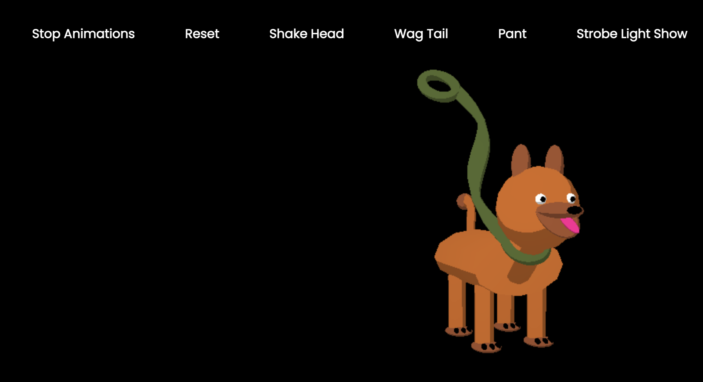

# ThreeJS-Dog

## A three.js web app that runs in any modern browser with WebGL enabled.
### Available animations: Shake Head, Wag Tail, Pant (move tongue), Strobe Light. 
### Optional buttons to stop animations and to reset the dog to it's initial state. 

Starter code provided by Kartikeya Sharma.
